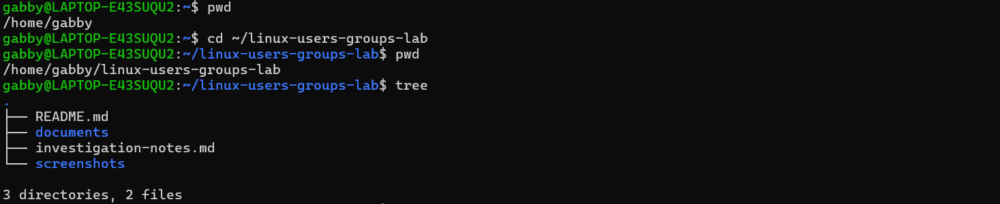
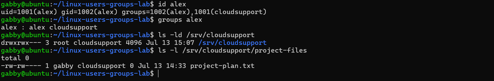
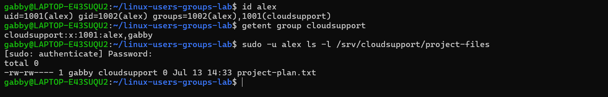

# 👥 Linux Users & Groups Administration

## Overview

This project simulates configuring secure access to shared resources in a Linux environment. The objective was to create users and groups, apply least-privilege permissions, troubleshoot access issues, and verify that only authorized users could access shared files.

**Status:** ✅ Complete

---

## Skills Demonstrated

- Linux user and group administration
- Linux permissions and ownership
- Access control and least privilege
- Troubleshooting and root cause analysis
- Technical documentation
- Git and GitHub workflow

---

## Tools Used

- Ubuntu 26.04 LTS (WSL2)
- Bash
- Git
- GitHub
- Visual Studio Code

---

## Scenario

This project simulates configuring a secure shared project directory for an operations team. Team members require access to shared documentation while preventing unauthorized users from viewing or modifying sensitive files.

The solution uses Linux users, groups, ownership, and permissions while following the principle of least privilege and Linux filesystem best practices.

---

## What I Did

- Created a Linux user (`alex`) and a shared group (`cloudsupport`)
- Configured a shared project directory with secure group ownership
- Applied least-privilege permissions using `chmod` and `chgrp`
- Investigated and resolved an access issue caused by parent directory permissions
- Relocated shared resources to `/srv/cloudsupport` following Linux filesystem standards
- Verified access using a secondary user account

### Key Commands

```bash
sudo groupadd cloudsupport
sudo useradd -m alex
sudo passwd alex
chgrp cloudsupport /srv/cloudsupport
chmod 770 /srv/cloudsupport
sudo -u alex ls -l /srv/cloudsupport/project-files
```

---

## Verification

The solution was verified by testing access from multiple user accounts and confirming that only authorized users could access the shared project directory.

### Verification Results

```text
uid=1001(alex)
groups=1002(alex),1001(cloudsupport)

drwxrwx--- root  cloudsupport project-files
-rw-rw---- gabby cloudsupport project-plan.txt
```

| Test | Result |
|------|--------|
| Linux user created | ✅ Passed |
| Linux group created | ✅ Passed |
| User added to shared group | ✅ Passed |
| Ownership configured | ✅ Passed |
| Permissions configured | ✅ Passed |
| Access verified using `alex` | ✅ Passed |
| Unauthorized access prevented | ✅ Passed |

---

## Screenshots

### Project Structure



---

### Technical Implementation



---

### Verification



---

## Key Takeaways

This project reinforced that Linux access control depends on both file permissions and directory permissions. During troubleshooting, I discovered that correct file permissions alone were insufficient because execute permission is required on every parent directory in the path.

Rather than weakening the security of a user's home directory, I relocated the shared resources to `/srv/cloudsupport`, following Linux filesystem best practices for shared service resources.

This project also strengthened my understanding of how Linux users, groups, ownership, and permissions work together to provide secure access while following the principle of least privilege.

---

## Next Steps

- Configure SetGID for automatic group inheritance
- Implement POSIX Access Control Lists (ACLs)
- Automate user and group provisioning with Bash
- Deploy the solution on an AWS EC2 Linux instance
